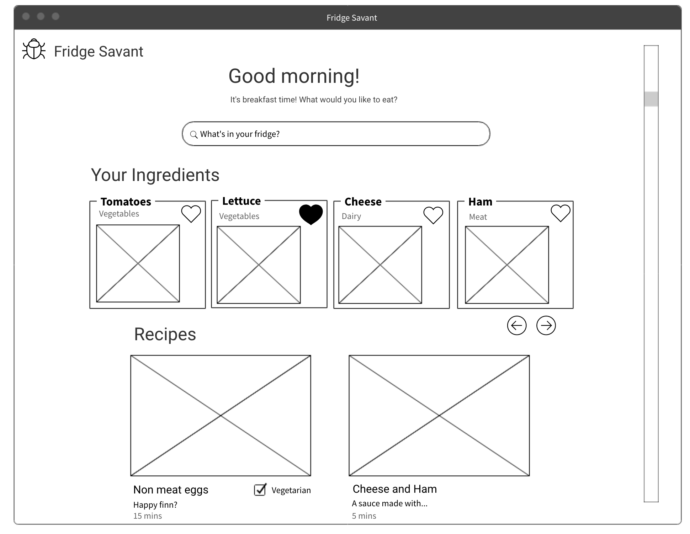
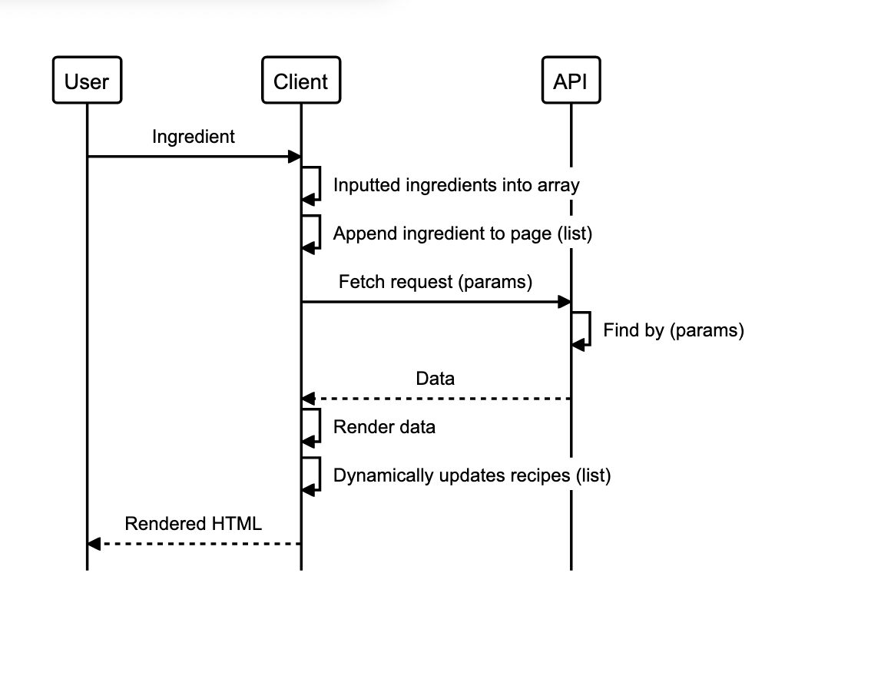

[About](#About) || [Run](#Run) the server || Our [Tech Stack](#tech-stack) || Meet the [Team](#team)

----------------------------------------
## About
----------------------------------------
<p> Designed to inspire creativity in the kitchen when your fridge looks bare, the app makes decision making easier when it comes to meal times. By encouraging you to use up the ingredients you have to hand, Fridge Savant helps you to reduce food waste, and so manage your budget better. </p>

----------------------------------------
## Set-up
----------------------------------------
The team made the decision to have a very common client-server type architecture. 
As you are reading information here about the server side of the application, you will also have to run the client side written in React.
You can find the client-side application [here](https://github.com/jasonrowsell/fridge-savant-client).

#### Run
```
$ git clone git@github.com:mikejeuga/fridge-savant-server.git
$ cd fridge-savant-server
$ npm run server
```
Navigate on port:[5000](http://localhost:5000).

[](https://travis-ci.com/mikejeuga/fridge-savant-server)

----------------------------------------
## Tech Stack
----------------------------------------
### Codebase
- MongoDB
- Express
- React
- Node

### Testing Framework:
Client end: 
- Jest

Server side: 
- Jest
- Postman

----------------------------------------
## Design and Approach
----------------------------------------
### Project Management
- [Trello Board](https://trello.com/b/U40Atkm9/fridge)

### User stories
```
As a User
So that I can find new recipes,
I want to be able to list the ingredients from my fridge.
```
```
As a User
So that I can find more recipes,
I want to be able to add ingredients to my existing list.
```

```
As a User
So that I can refine my recipe search,
I want to be able to remove ingredients from my existing list.
```

```
As a User
So that I can have tailored experience,
I want to be able to have a personal profile.
```

```
As a User
So that I can be social,
I want to be able to share recipes on social media platforms.
```

```
As a User
So that I don't have to search again a recipe,
I want to be able to bookmark my favourite dishes.
```

```
As a User
So that I can have cook quickly or share again,
I want to be able to see my favourite dishes.
```

### Diagrams

<details>
  <summary> Design mock up </summary> <br>
    
  <br>
</details>

<details>
  <summary> MVP sequence diagram </summary> <br>
    
  <br>
</details>
<br>


----------------------------------------
## Project Goals
----------------------------------------
- Make the best out of what is left in the fridge.
- Learn a new tech stack (MERN) as we build.
- Keeping a 95% test coverage.
- Have fun


----------------------------------------
## Team
----------------------------------------
- Matt Dawson | [GitHub](https://github.com/MattDawson2020)
- Noa Farber | [GitHub](https://github.com/noarfarber)
- Kane Gin | [GitHub](https://github.com/KaneG9)
- Mike Jeuga | [GitHub](https://github.com/mikejeuga)
- Jason Rowsell | [GitHub](https://github.com/jasonrowsell)
- Finn Williamson | [GitHub](https://github.com/fwill22)

[Top](#About)
